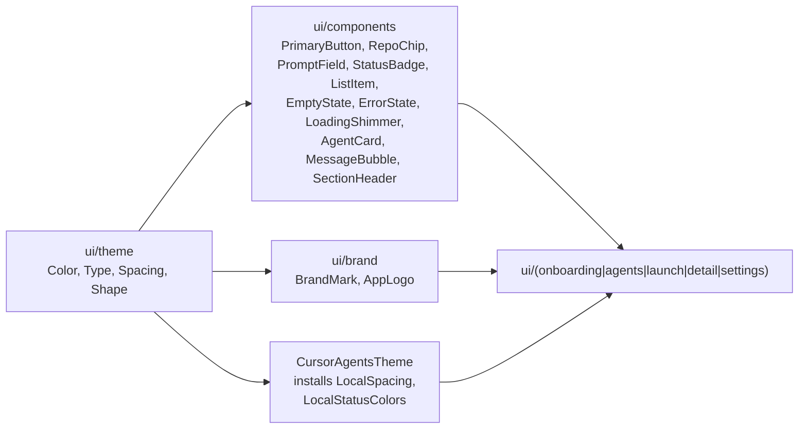

# Visual Foundation v0 - Plan

Make the app actually look like the design tokens already declared, finish CUR-7 in code, polish all 5 screens (CUR-10), and ratify CUR-8 brand decisions in the codebase. Single feature branch, single PR (or split if it gets too large at review time).

## Brand decisions (locked, per user)

- App name: **Cursor Agents** (keep current; defer renaming to a future ticket if user wants)
- Accent: keep `#5E6AD2` (Linear-inspired indigo from [`Color.kt`](app/src/main/kotlin/fr/lawmight/cursoragents/ui/theme/Color.kt))
- Fonts: **Inter** (sans, weights 400/500/600) + **JetBrains Mono** (mono, 400) bundled in `res/font/` (SIL OFL, no Play Services dep)
- Status colors: keep existing 5 (creating / running / finished / stopped / failed) but recompute on-color per-status for WCAG AA (`StatusStopped` `#8A8A93` currently fails on white text)

## Architecture (kept stable)

ViewModels are intentionally **out of scope** for this pass to keep the PR reviewable - screens use `remember`/`rememberSaveable` and `@Preview`-driven mock data. ViewModel wiring follows in a CUR-N fast-follow.

## Phase A - Brand + theme correctness

1. **Fonts**: download Inter (400/500/600) and JetBrains Mono (400) `.ttf` from their official repos (both SIL OFL); place in [`app/src/main/res/font/`](app/src/main/res/font/) as `inter_regular.ttf`, `inter_medium.ttf`, `inter_semibold.ttf`, `jetbrains_mono_regular.ttf`. Add `font_certs.xml` not needed (bundled, not downloadable).
2. Rewrite [`Type.kt`](app/src/main/kotlin/fr/lawmight/cursoragents/ui/theme/Type.kt) using `FontFamily(Font(R.font.inter_regular, FontWeight.Normal), ...)` and a real Material 3 typography scale (`displayLarge` through `labelSmall`) with deliberate sizes/letter-spacing tuned for the 360-411dp target range.
3. **Theme correctness** in [`Theme.kt`](app/src/main/kotlin/fr/lawmight/cursoragents/ui/theme/Theme.kt):
   - Define a real `LightColors` (`background #FAFAFA`, `surface #FFFFFF`, `surfaceVariant #F2F2F5`, `onBackground #0A0A0A`, `onSurface #171717`, `onSurfaceVariant #5C5C66`, `outline #E5E5EA`, `error #C42B2B`).
   - Add `LightStatusColors` for the data-class so `StatusBadge` reads correctly in both modes.
   - **Install `LocalSpacing` and `LocalStatusColors`** via `CompositionLocalProvider` inside `CursorAgentsTheme` (currently `LocalSpacing` is declared in [`Spacing.kt`](app/src/main/kotlin/fr/lawmight/cursoragents/ui/theme/Spacing.kt) but never provided).
4. **Edge-to-edge polish** in [`themes.xml`](app/src/main/res/values/themes.xml) + new `values-night/themes.xml`: transparent system bars, light/dark icon variants via `windowLightStatusBar` and `windowLightNavigationBar` (API 27+).
5. **Splash**: add `androidx.core:core-splashscreen` to [`libs.versions.toml`](gradle/libs.versions.toml) + [`app/build.gradle.kts`](app/build.gradle.kts), create `Theme.CursorAgents.Starting` in `themes.xml`, install via `installSplashScreen()` in [`MainActivity.kt`](app/src/main/kotlin/fr/lawmight/cursoragents/MainActivity.kt).
6. **Launcher icon**: replace [`ic_launcher_foreground.xml`](app/src/main/res/drawable/ic_launcher_foreground.xml) and [`ic_launcher_background.xml`](app/src/main/res/drawable/ic_launcher_background.xml) with a simple branded mark - lowercase `c` glyph or chevron in white on accent `#5E6AD2`. Adaptive icon (108x108 viewport, 72x72 safe zone) using `<vector>` paths so we don't ship raster assets.

## Phase B - CUR-7 primitives (Compose)

All in [`app/src/main/kotlin/fr/lawmight/cursoragents/ui/components/`](app/src/main/kotlin/fr/lawmight/cursoragents/ui/components/), each with `@Preview` in light + dark via a tiny `PreviewSurfaces.kt` helper. Components leverage `LocalSpacing.current` (no magic dp values per [AGENTS.md](AGENTS.md)).

- `PrimaryButton.kt` - filled accent, height 48dp, supports `loading` state with `CircularProgressIndicator`, disabled style.
- `SecondaryButton.kt` - outlined variant.
- `IconButton.kt` (rename existing usages to avoid collision with Material's - call it `GhostIconButton`) - 40dp tap target, ghost + tonal variants.
- `RepoChip.kt` - leading repo icon, owner/name, optional close affordance, uses `surfaceVariant`.
- `StatusBadge.kt` (refactor existing) - per-status foreground color computed for AA contrast, optional pulsing dot for `RUNNING` and `CREATING`, sizes `Small`/`Medium`.
- `PromptField.kt` - multi-line `OutlinedTextField` wrapper with placeholder, focus border in accent, optional char-count, optional voice/attach trailing slot.
- `ImageAttachPill.kt` - rounded thumbnail (Coil) + filename + remove button.
- `ListItem.kt` - leading slot, title (`bodyLarge`), subtitle (`bodyMedium muted`), trailing slot, divider variant.
- `EmptyState.kt` - large icon, title, body, primary CTA.
- `ErrorState.kt` - icon, message, retry CTA.
- `LoadingShimmer.kt` - simple animated `Brush.linearGradient` shimmer for `AgentCard` and `ListItem` skeletons.
- `AgentCard.kt` - composes `StatusBadge` + repo line + summary + age - the row used in agent list.
- `MessageBubble.kt` - user vs agent variants for the conversation in detail screen.
- `SectionHeader.kt` - small caps muted label for grouping form sections.

## Phase C - CUR-10 screen polish

Each screen gets `@Preview`s for default + empty + loading + error states.

- [`OnboardingScreen.kt`](app/src/main/kotlin/fr/lawmight/cursoragents/ui/onboarding/OnboardingScreen.kt) - centered `BrandMark` + tagline + secure-input `PromptField` with show/hide eye, inline validation error using `ErrorState` style, "Get an API key" `SecondaryButton`, primary `PrimaryButton` with `loading` while validating.
- [`AgentListScreen.kt`](app/src/main/kotlin/fr/lawmight/cursoragents/ui/agents/AgentListScreen.kt) - top app bar with brand wordmark + settings, `LazyColumn` of `AgentCard`s sorted by recency, pull-to-refresh, swap to `EmptyState`/`LoadingShimmer`/`ErrorState` based on UI state, extended FAB "New agent".
- [`LaunchAgentScreen.kt`](app/src/main/kotlin/fr/lawmight/cursoragents/ui/launch/LaunchAgentScreen.kt) - section-grouped form: Repository (`RepoChip` opens picker stub), Branch (text field defaulting to `main`), Prompt (`PromptField` with attach + voice slots), Options (auto-create PR `Switch`). Sticky bottom `PrimaryButton` "Launch agent".
- [`AgentDetailScreen.kt`](app/src/main/kotlin/fr/lawmight/cursoragents/ui/detail/AgentDetailScreen.kt) - **fix the `"Agent \$agentId"` literal-backslash bug**, top app bar with `StatusBadge`, summary block, conversation `LazyColumn` of `MessageBubble`s, sticky follow-up `PromptField`, overflow menu with Stop / Delete / Open PR.
- [`SettingsScreen.kt`](app/src/main/kotlin/fr/lawmight/cursoragents/ui/settings/SettingsScreen.kt) - sectioned `ListItem`s: API Keys (with subtitle showing active alias), Theme (System/Dark/Light radio group), Default Model, About (links to repo + license).

## Phase D - Bug fixes + plumbing

- Fix [`AppNavHost.kt`](app/src/main/kotlin/fr/lawmight/cursoragents/ui/nav/AppNavHost.kt) line 19 - `"agent/\$id"` -> `"agent/$id"` (currently navigation to detail is broken because the route literal contains a backslash).
- Add new strings to [`strings.xml`](app/src/main/res/values/strings.xml) for empty / loading / error copy.
- Add `androidx.compose.ui:ui-text-google-fonts` is **not** needed (bundled fonts).

## Out of scope (call out for follow-ups)

- Real ViewModels with `StateFlow<UiState>` per [AGENTS.md](AGENTS.md) - tracked as a fast-follow PR.
- Wiring screens to the live API (`AgentsRepository` already exists, but UI is currently driven by `@Preview` mocks for design iteration).
- Resuming Figma component / screen pages - blocked on Figma Starter 3-page cap + current MCP rate limit. Next step there is a Pro upgrade or waiting out the limit.
- Voice input (CUR roadmap), share intent, FCM push, widget.

## Acceptance

- `./gradlew :app:assembleDebug` is green.
- `./gradlew testDebugUnitTest ktlintCheck detekt` is green (or no new warnings vs `main`).
- Every component file has `@Preview`s for light + dark.
- Manual run on a device: each of the 5 screens reachable, no `\$` literal text, system bars look right, app icon is the new mark, splash shows the mark briefly on cold start.
- Linear: comment on CUR-7, CUR-8, CUR-10 with PR link; do **not** auto-close (user keeps that authority).